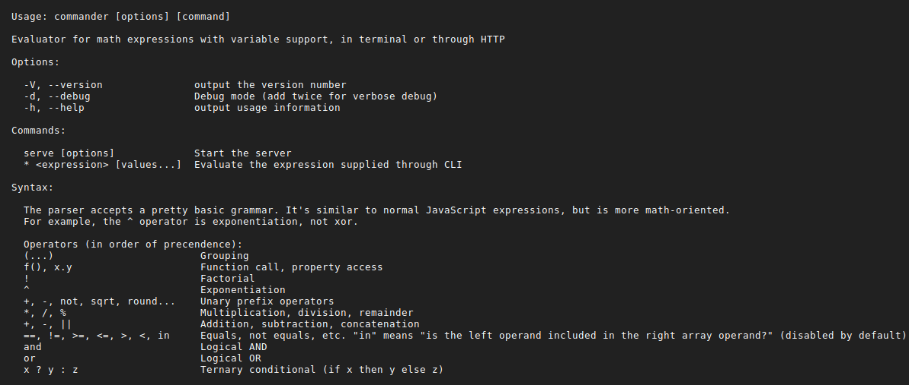
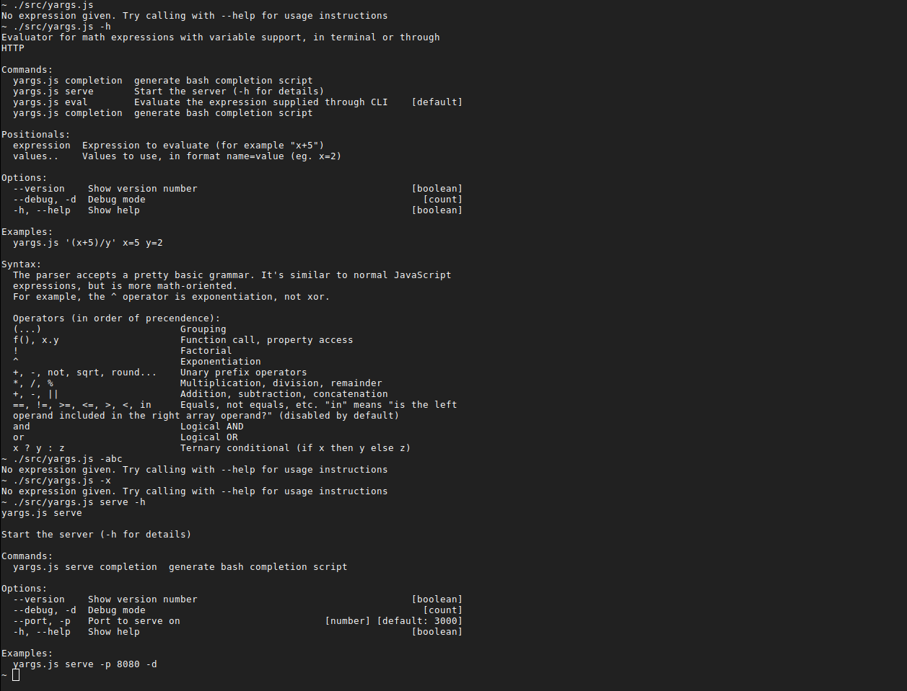
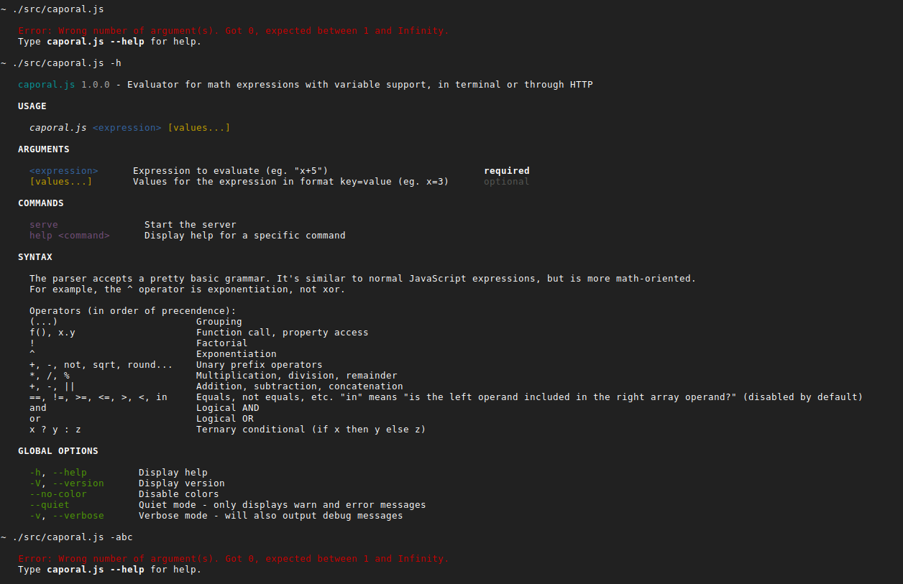
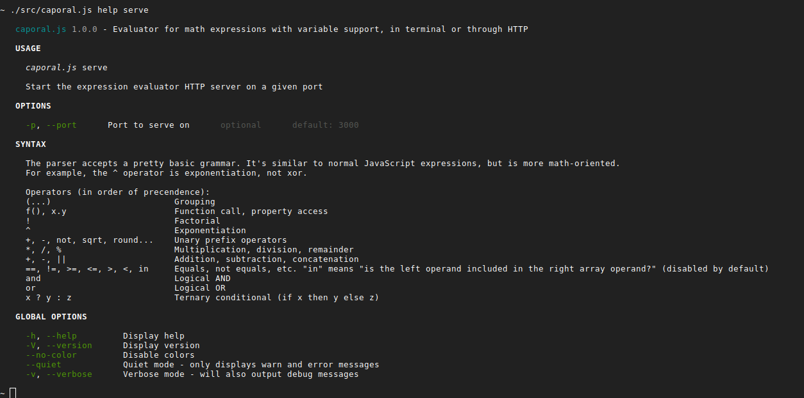
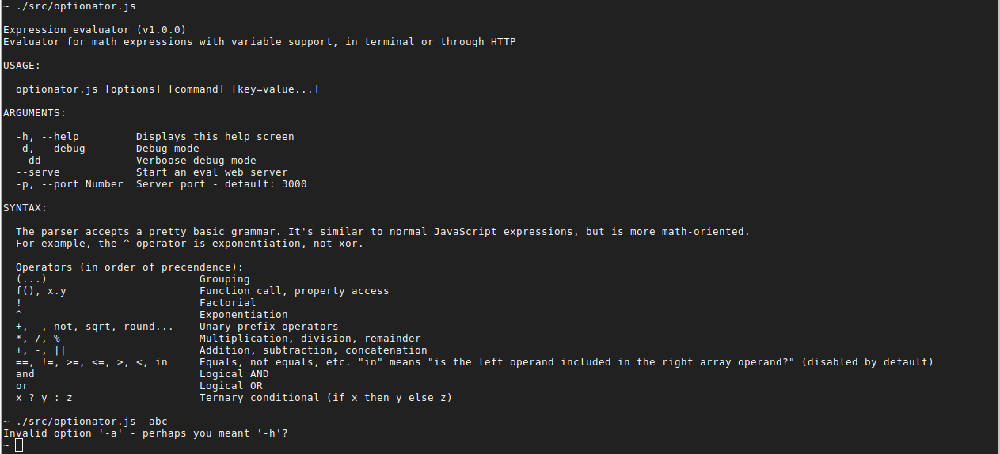
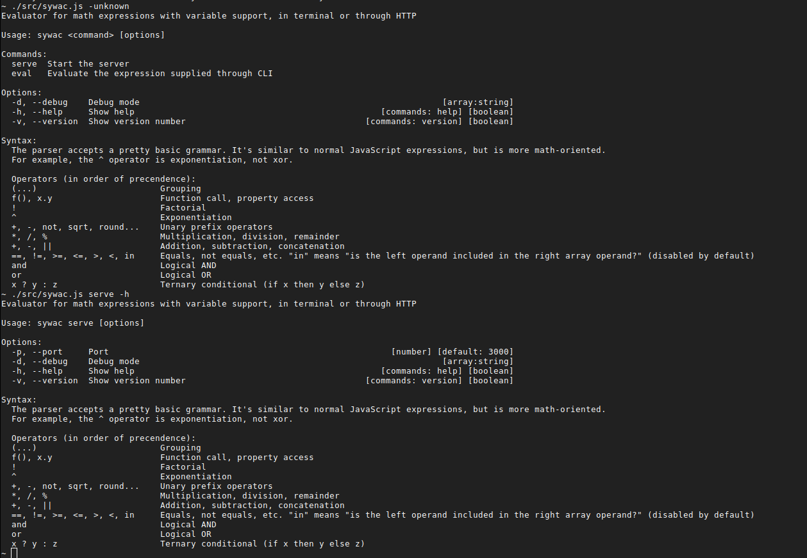
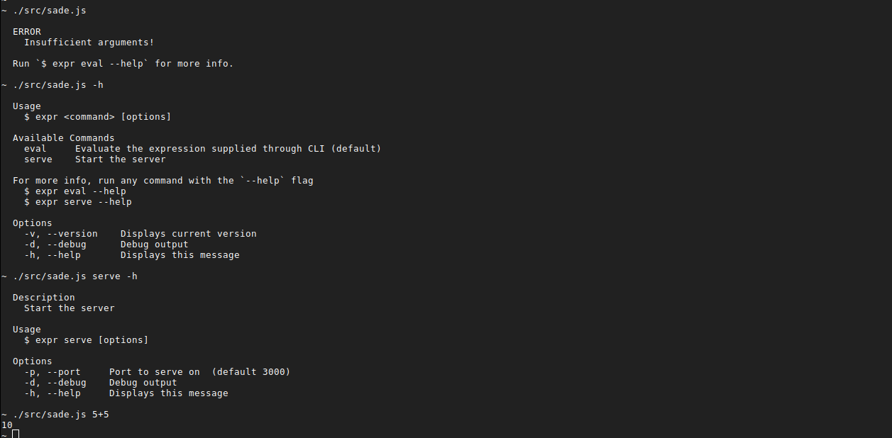
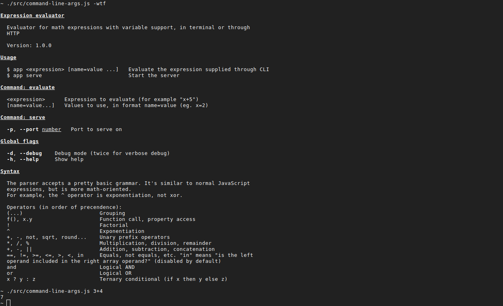
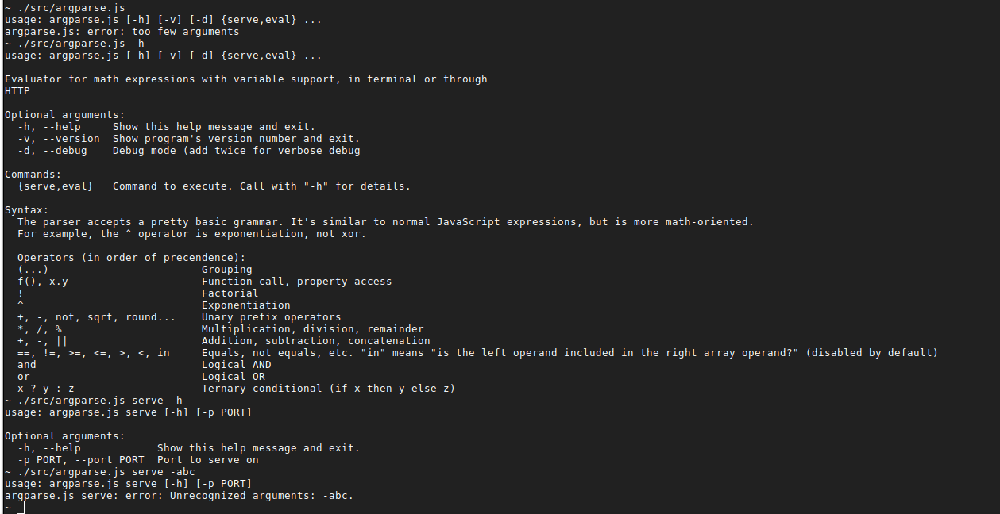

# Node.js argument parsers in 2018

Recently, I was in a need of a command line argument parser to use for node.js tooling at the dayjob. In some node.js problem spaces, there is a clear winner; one library that is the default golden path for most developers, for most use cases. For example, [express.js](https://expressjs.com/) for web servers or [moment.js](https://momentjs.com/) for date/time manipulation. That doesn't seem to be the case for command line parsers.

Over time, different contenders seem to have come into prominence and then faded away. It's not clear which one is currently "the best", if there can even be such a thing, or at least the accepted standard. So I decided to do a little cross-comparison test.

## Testing method

To test different argument parsers, we need a program they will parse the arguments for. I have opted for a simple math expression evaluator. You call it with an expression (eg. given `x=5`, calculate `(2 + x) / 3`) and it spits out the result to console or serve it on the web, depending on arguments.

Here is the interface I'd like to support:

Command|What happens
-------|------------
`app -h`|Help screen is shown. It should also work with `--help`.
`app '(x*5)/y'`|Start the app in STDIN mode. Given expression will be executed for each input line (treated as CSV of values in the order they appear inside the expression)
`app '(x*5)/y' x=5 y=7`|In this mode, the command is immediately executed using any number of `var=value` arguments that come at the end.
`app -dd`|Start the app in verbose debug mode (`-d` for normal debug mode). This switch should apply globally, for either web server or CLI use case.
`app serve -p 12345`|Start expression evaluator web server, listening on port `12345`. Note that -p argument only makes sense here. It shouldn't be applicable to the CLI use case.

For each parser, I will write an app implementing the interface above or a close approximation of it (I will allow deviations from the API, as long as the full functionality is covered).
 
I will then judge the parsers based on a few loose criteria:
- How much functionality is in it? How well can it execute my requirements?
- Can it output help text and errors correctly? How well is output formatted?
- Does it have a good API? How much boilerplate is needed?
- What is the documentation like? Can I get some intellisense going?
- What is the general feel of the library? Is it popular? Maintained?  
   
 
All parsers will call into the same library code, which can be seen here [here](https://git.pantas.net/articles/node_argument_parsers/src/master/src/lib.js). The only important bits are the exports, shown below: 

```javascript
module.exports = {
  // A bunch of strings with different help texts (title, description, syntax help)
  INFO,
  
  // Default values for port and such
  DEFAULTS,

  // Call this method to evaluate an expression and write the result to STDOUT
  evaluateToStdOut,
  
  // Call this method to start a web server
  serve,

  // A utility to parse something like "x=5" into meaningful values
  valuesFromPairs,
};
```

## Rejected candidates

Before I go through the main contenders, I'll go through the ones I have rejected based on reading the documentation and fiddling a bit, but without writing the actual test program.

### Minimist

`minimist` | [](https://github.com/substack/minimist) &nbsp; [](https://www.npmjs.com/package/minimist)
|-----|----|
Stars | 3,055
Forks | 172
Downloads / week | 13,222,137
Dependencies | [0](http://npm.broofa.com/?q=minimist)
Licenses | MIT

A venerable and extremely popular library. It has two problems, though:

1. Last updated in 2015
2. No option definitions at all

To clarify the second point, you use minimist like this:

```javascript
var argv = require('minimist')(process.argv.slice(2));
console.dir(argv);
```

```bash
$ node example/parse.js -a beep -b boop
{ _: [], a: 'beep', b: 'boop' }
```

Instead of giving it option definitions, you just call it against arguments and it then tries to guess what they mean and packages them into an object. So, no varargs, no help screens, no validation. I'd have to build all of that manually on top of it.

I've decided that's too barebones for what I want out of an argument parser library. Therefore minimist is out.

### Nopt

`nopt` | [](https://github.com/npm/nopt) &nbsp; [](https://www.npmjs.com/package/nopt)
|-----|----|
Stars | 460
Forks | 35
Downloads / week | 7,145,337
Dependencies | [2/4](http://npm.broofa.com/?q=nopt)
Licenses | MIT

What's this? Relatively few github stars, but tons of npm downloads? Turns out, this is the lib that npm.js developed internally to handle parsing for their npm utility (that's why the download count).

> If you want to write an option parser, don't write an option parser. Write a package manager, or a source control system, or a service restarter, or an operating system. You probably won't end up with a good one of those, but if you don't give up, and you are relentless and diligent enough in your procrastination, you may just end up with a very nice option parser.

Unfortunately, even though it has predefined argument definitions, it doesn't seem to have a help layer at all. A weird in-house-ish project that never caught on, doesn't get updated often and should probably be avoided.

### Gar

`gar` | [](https://github.com/ethanent/gar) &nbsp; [](https://www.npmjs.com/package/gar)
|-----|----|
Stars | 24
Forks | 2
Downloads / week | 11,787
Dependencies | [0](http://npm.broofa.com/?q=gar)
Licenses | MIT

"Like minimist and optimist, only even smaller (4kb)". It gets disqualified for the same reasons as mininist.

## Candidates

For each of the following candidates, I have written a full implementation of the target program.

### commander.js

`commander` | [](https://github.com/tj/commander.js) &nbsp; [](https://www.npmjs.com/package/commander)
|-----|----|
Stars | 11K
Forks | 907
Downloads / week | 11M
Dependencies | [0](http://npm.broofa.com/?q=commander)
Licenses | MIT

*Commander* has the strongest github presence out of all tested libraries. It's one of "the big two" (besides *yargs*). It's inspired by Ruby's [commander](https://github.com/commander-rb/commander) library.

The basic interface is pretty straightforward. You attach global options directly to the imported module. Then call `.command()` for each command you want to support, and attach additional options to the returned command instance using a fluid API.

After parsing, common options will be attached on the `program` object, while command specific switches will go to the `cmd` argument to the command function. This was a bit confusing at first, but I got used to it.


```javascript
#!/usr/bin/env node

const lib = require('./lib');

const program = require('commander');

program
  .version(require('../package').version)
  .description(lib.INFO.description)
  .option('-d, --debug', 'Debug mode (add twice for verbose debug)', (_, debug) => debug + 1, 0);

let executed = false;

program
  .command('serve')
  .description('Start the server')
  .option(
    '-p, --port <port>',
    `Port to serve on (default: ${lib.DEFAULTS.port})`,
    p => Number(p) || undefined
  )
  .action(cmd => {
    executed = true;
    lib.serve(cmd.port, program.debug);
  });

program
  .command('* <expression> [values...]')
  .description(`Evaluate the expression supplied through CLI`)
  .action((expression, valuePairs) => {
    executed = true;
    const values = lib.valuesFromPairs(valuePairs);
    lib.evaluateToStdOut(expression, values, program.debug);
  });

program.on('--help', () => {
  console.log();
  console.log('  Syntax:');
  console.log();
  console.log(
    lib.INFO.syntax
      .split('\n')
      .map(line => '    ' + line)
      .join('\n')
  );
  console.log();
});

program.parse(process.argv);

if (!executed) {
  program.outputHelp();
}
```



#### Thoughts

- It supports commands and default commands, it can generate help with description text and version number and collect multiple arguments using reduce-like syntax (very neat).

- Good typings support out of the box and no dependencies, both increasingly important features for me.

- The library's age shows. I get a strong odor of a legacy project, where more and more features have been added over the years, distorting the original API surface of the project.
                           
  For example, if you do
	```
	program.command('cmd', 'My command')
	```
  commander will try to find and execute file `app-cmd.js`. The way this differs from "normal" commands is the existence of the description (the second argument). But why can't I describe normal commands? Very strange and non-intuitive API, in my opinion.

- The way you specify long and short parameter names is kind of clumsy. You can't have a short option without a corresponding long version.
  
- I had issues implementing the default subcommand. The way this is supposed to work is through `isDefault` option. However, I could only get it to work with git-style commands (where name of the command is directly mapped to an executable on HDD). It doesn't work with `action` style callbacks.
  
  I ended up "solving" that by naming my CLI command `"*"`, but that produces a rather ugly help screen (see above).

- There is no concept of default value. You have to insert it into the help text manually (eg. `.option('-p, --port', 'Port to serve on (default: 3000)')`)

- Varargs are not marked in the help text. Need to be done manually.

- There is no way to tell which command has been executed, if any.

#### Conclusion

Commander is not outstanding in any particular metric, but is at least solid in all of them. A decent all-around choice.

## Yargs

`yargs` | [](https://github.com/yargs/yargs) &nbsp; [](https://www.npmjs.com/package/yargs)
|-----|----|
Stars | 4K
Forks | 415
Downloads / week | 17M
Dependencies | [12 / 50](http://npm.broofa.com/?q=yargs)
Licenses | ISC, MIT

This pirate-themed library is the second most popular argument parser on the list. I find the overall presentation a bit goofy, but that doesn't stop yarrgs from being *very* powerful.

You specify options using a fluid api. You are encouraged to make the entire yargs usage a one statement. It supports all needed options to make the API that strongly matches my specification.

```javascript
#!/usr/bin/env node

const lib = require('./lib');

const yargs = require('yargs');

yargs
  .usage(lib.INFO.description)
  .version()
  .alias('h', 'help')
  .epilog(
    'Syntax:\n' +
      lib.INFO.syntax
        .split('\n')
        .map(line => '  ' + line)
        .join('\n')
  )
  .completion('completion')

  .option('debug', {
    alias: 'd',
    describe: 'Debug mode',
    count: true,
  })

  .command(
    'serve',
    'Start the server (-h for details)',
    args => {
      args
        .completion('completion')
        .option('port', {
          describe: `Port to serve on`,
          default: lib.DEFAULTS.port,
          alias: 'p',
          type: 'number',
        })
        .example('$0 serve -p 8080 -d');
    },
    argv => {
      lib.serve(argv.port, argv.debug);
    }
  )

  .command(
    ['eval', '$0'],
    'Evaluate the expression supplied through CLI',
    args => {
      args
        .completion('completion')
        .positional('expression', {
          describe: 'Expression to evaluate (for example "x+5")',
        })
        .positional('values..', {
          describe: 'Values to use, in format name=value (eg. x=2)',
        })
        .example(`$0 '(x+5)/y' x=5 y=2`);
    },
    argv => {
      if (!argv._.length) {
        console.log('No expression given. Try calling with --help for usage instructions');
        return;
      }

      const [expression, ...valuePairs] = argv._;

      const values = lib.valuesFromPairs(valuePairs);
      lib.evaluateToStdOut(expression, values, argv.debug);
    }
  )

  .parse();
```



#### Thoughts

- The library seems to have recently gone through a serious transition, where it has moved from a fully fluid to a more object-based configuration notation. Unfortunately, the old api and docs remain around, which makes figuring out how to do things harder than it needs to be (in 2018). In my program, I have decided to use object-notation to define all the arguments and their switches.

- In general, I found the documentation rather lacking. Example: Variadic positional arguments are only mentioned briefly in the advanced usage guide, and are missing from the central API docs.

  On the other hand, the library does have a LOT of features, so it's somewhat understandable that they are not all documented perfectly consistently. 

- Code completion is awful out of the box, but there is a `@typings` library available that makes it better.

- There is no way to add text preamble, with program description. I used the "usage" field for that.

- Help for commands is not displayed directly on the screen. User has to do "`program command -h`" in order to get help. That is not clearly indicated anywhere on the screen. I ended up adding a little pointer manually.

- I couldn't get it to display full help in case command was called without an expression. I had to add a hacky `console.log` message for that case.

- This is one of rare libraries that also generates a bash completion. I had to manually add my app to ENV, but after that, I got it working.

#### Conclusion

One of the most powerful and popular libraries around. On the downside, I personally fond it unpleasant to use (due to confusing api and docs), and its help output rather unremarkable.

## Caporal

`caporal` | [](https://github.com/mattallty/Caporal.js) &nbsp; [](https://www.npmjs.com/package/caporal)
|-----|----|
Stars | 2K
Forks | 92
Downloads / week | 15K
Dependencies | [11 / 80](http://npm.broofa.com/?q=caporal)
Licenses | None, Apache-2.0ISC, MIT

From their own description:

> A full-featured framework for building command line applications (cli) with node.js, including help generation, colored output, verbosity control, custom logger, coercion and casting, typos suggestions, and auto-complete for bash/zsh/fish.

Why would you need a framework for parsing command line arguments? Let's find out.

```javascript
#!/usr/bin/env node

const lib = require('./lib');

const prog = require('caporal');

prog
  .version(require('../package').version)
  .description(lib.INFO.description)
  .help(lib.INFO.syntax, {
    name: 'SYNTAX',
  })

  .argument('<expression>', 'Expression to evaluate (eg. "x+5")')
  .argument('[values...]', 'Values for the expression in format key=value (eg. x=3)')
  .action((args, options, logger) => {
    const level = getDebugLevel(logger);
    const values = lib.valuesFromPairs(args.values);

    lib.evaluateToStdOut(args.expression, values, level);
  })

  .command('serve', 'Start the server')
  .help('Start the expression evaluator HTTP server on a given port')
  .option('-p, --port', 'Port to serve on', prog.INT, lib.DEFAULTS.port)
  .action((args, options, logger) => {
    const level = getDebugLevel(logger);

    lib.serve(options.port, level);
  });

prog.parse(process.argv);

function getDebugLevel(logger) {
  const wLevel = logger.transports.caporal.level;
  if (wLevel === 'info') {
    return 1;
  }
  if (wLevel === 'debug') {
    return 2;
  }
  return 0;
}
```




#### Thoughts

- Caporal is indeed a framework. It wants all your code to live inside its action() callbacks that are triggered based on CLI commands. They automatically parse logger verbosity options, create a winston logger and feed it to your command methods. This is all *extremely* opinionated - their way or the highway. 

- In general I like how help is formatted (colors always help).

- There is no way to write anything beneath the global command line switches in options. Also, there is no way to get a hook into the help system through an event or similar mechanism. AND you can't disable auto-help and display the help manually. I ended up just adding a "SYNTAX" section that is printed out right above the global options. I am not thrilled how it looks.

- Since they auto-parse verbosity, I've decided to use their API surface, with `--verbose,-v` and `--silent` switches, instead of my intended `-dd` api.

- It doesn't support flag aggregation. For example, I couldn't even do "`-dd`", only "`-d -d`" which is lame.

- Documentation is poor. I had to dig through their source code multiple times.

- When you call the program without arguments, you get a super goofy error message: `Error: Wrong number of argument(s). Got 0, expected between 1 and Infinity.`. There doesn't seem to be a way to customize it.

- Caporal claims to have auto-completion, but I couldn't get it to work.

#### Conclusion

The Caporal "framework" alows you to put together pretty nice CLI app without a lot of effort. If you want something super quick or exactly agree with their decisions, it's an OK choice. But it's not for me.

## Optionator

`optionator` | [](https://github.com/gkz/optionator) &nbsp; [](https://www.npmjs.com/package/optionator)
|-----|----|
Stars | 100
Forks | 7
Downloads / week | 4M
Dependencies | [6](http://npm.broofa.com/?q=optionator)
Licenses | MIT

From their site:

> Optionator is a JavaScript/Node.js option parsing and help generation library used by eslint, Grasp, LiveScript, esmangle, escodegen, and many more.

Small amount of stars and a huge number of downloads indicate an internal-ish library used by a small "cabal" of popular libraries (as indicated by disparity of npm downloads and stars). It hasn't been updated since 2016, but that's not necessarily a deal killer. Sometimes, software is just "complete".

More from the site:

> The problem with other option parsers, such as yargs or minimist, is they just accept all input, valid or not. With Optionator, if you mistype an option, it will give you an error (with a suggestion for what you meant). If you give the wrong type of argument for an option, it will give you an error rather than supplying the wrong input to your application.
>  
>  ```
>  `$ cmd --halp
>  Invalid option '--halp' - perhaps you meant '--help'?
>  ```
>
>  ```
>  $ cmd --count str
>  Invalid value for option 'count' - expected type Int, received value: str.
>  ```

Interesting, but I am not sure I want my arg parser library to do all that.

Unlike the libraries we've seen so far, this one uses a more conservative, declarative API.

```javascript
#!/usr/bin/env node

const Optionator = require('optionator');

const lib = require('./lib');

const optionator = Optionator({
  prepend: `
${lib.INFO.title} (v${require('../package').version})
${lib.INFO.description}

USAGE:

  optionator.js [options] [command] [key=value...]

ARGUMENTS:`,
  append: `SYNTAX:

${lib.INFO.syntax
    .split('\n')
    .map(line => '  ' + line)
    .join('\n')}
`,
  options: [
    {
      option: 'help',
      alias: 'h',
      type: 'Boolean',
      description: 'Displays this help screen',
    },
    {
      option: 'debug',
      alias: 'd',
      type: 'Boolean',
      description: 'Debug mode',
    },
    {
      option: 'dd',
      type: 'Boolean',
      description: 'Verboose debug mode',
    },
    {
      option: 'serve',
      type: 'Boolean',
      description: 'Start an eval web server',
    },
    {
      option: 'port',
      alias: 'p',
      type: 'Number',
      default: String(lib.DEFAULTS.port),
      description: 'Server port',
      dependsOn: ['serve'],
    },
  ],
});

let options;
try {
	options = optionator.parseArgv(process.argv);
}
catch (err) {
	console.log(err.message);
	process.exit(1);
}

if (options.help) {
  showHelp();
}

const debugLevel = options.dd ? 2 : options.debug ? 1 : 0;

if (options.serve) {
  lib.serve(options.port, debugLevel);
} else {
  const expression = options._[0];
  if (!expression) {
    showHelp();
  }
  const values = lib.valuesFromPairs(options._.slice(1));
  lib.evaluateToStdOut(expression, values, debugLevel);
}

function showHelp() {
  console.log(optionator.generateHelp());
  process.exit(0);
}
```



#### Thoughts

- Big minus right away: the library doesn't support commands. I ended up triggering my server using switches.

- It doesn't support counting of joined flags. I had to use `--dd` instead of `-dd`.

- I had to add a lot of custom help text to `prepend` and `append` to make help text look decent (but not great).

- It will indeed try to correct the argument, but I personally find it more useful to direct users towards the -h flag.

- The library has a lot of fiddly options, but they feel like they've been added to fill some specific use case the author had, and are not overly useful in a general sense.

#### Conclusion

A minor library with "the one thing" to try and raise it above the crowd (validation stuff). Unfortunately, I don't find its "one thing" particularly useful, at least for the way I do things.

## Sywac

`sywac` | [](https://github.com/sywac/sywac) &nbsp; [](https://www.npmjs.com/package/sywac)
|-----|----|
Stars | 50
Forks | 1
Downloads / week | 2K
Dependencies | [0](http://npm.broofa.com/?q=sywac)
Licenses | MIT

The authors really went all out with this library - they bought a domain and made a logo and set up an [actual site]([site](http://sywac.io/)). Unfortunately, their marketing push has failed, judging by the number of stars and downloads.

None of this reflects in any way on the library itself. Its api is heavily inspired by yargs. I found it perfectly reasonable and clear to work with.

```javascript
#!/usr/bin/env node

const sywac = require('sywac');

const lib = require('./lib');

sywac
  .array('-d, --debug', { desc: 'Debug mode' })
  .help('-h, --help')
  .version('-v, --version')
  .outputSettings({ maxWidth: 100 })
  .showHelpByDefault()

  .preface(lib.INFO.description)

  .command('serve', {
    desc: 'Start the server',
    setup: sywac => {
      sywac.number('-p, --port', {
        desc: 'Port',
        defaultValue: lib.DEFAULTS.port,
      });
    },
    run: argv => {
      lib.serve(argv.port, argv.debug.length);
    },
  })

  .command('eval', {
    desc: 'Evaluate the expression supplied through CLI',
    setup: sywac => {
      sywac
        .positional('<expression>', {
          paramsDesc: 'Expression to evaluate',
        })
        .positional('[...values]', { paramsDesc: 'Values to use, in format name=value (eg. x=2)' });
    },
    run: argv => {
      if (argv.values[0] === undefined) {
        argv.values = [];
      }
      const values = lib.valuesFromPairs(argv.values);
      lib.evaluateToStdOut(argv.expression, values, argv.debug.length);
    },
  })

  .epilogue(
    'Syntax:\n' +
      lib.INFO.syntax
        .split('\n')
        .map(line => '  ' + line)
        .join('\n')
  )

  .parseAndExit();
```



#### Thoughts

- Sywac has a concept of "default command", but neither it nor its parameters are displayed anywhere on the help screen. User would have no idea it even exists. This feature frankly seems broken. I ended up just adding an `eval` command.

- The library doesn't have typings or JSDoc annotations. Intellisense in WebStorm was pretty poor.

- Documentation is set up with high ambitions, but as it stands now, it's only half-completed. Once again, I had to dig through source code to figure out how some features work.

- There is no aggregation type. I had to declare `-d` as `array` type, which kind of works but generates an ugly help text.

- It supports varargs as the last argument, but for some reason it returns `[undefined]` in case none are given. My code had to make up for it.

- It has solid help output, with defaults and types. There are a lot of other options there. For example, it offers hooks to colorize each element of the help screen (that *does* seem to be going a bit far). Due to incomplete state of documentation, I suspect there are at least some nuances I am missing here.

#### Conclusion

Nice and ambitious attempt, but due to bugs, incomplete documentation and low bus factor, I can't recommend this library at this point.

### Sade

`sade` | [](https://github.com/lukeed/sade) &nbsp; [](https://www.npmjs.com/package/sade)
|-----|----|
Stars | 300
Forks | 12
Downloads / week | 1.5K
Dependencies | [2/3](http://npm.broofa.com/?q=sade)
Licenses | MIT

From the home page:

> It enables default commands, git-like subcommands, option flags with aliases, default option values with type-casting, required-vs-optional argument handling, command validation, and automated help text generation!

Also...

> Your app's UX will be as smooth as butter... just like Sade's voice.

This reference will not get old at all.

The api is similar to *commander*.

```javascript
#!/usr/bin/env node

const sade = require('sade');

const lib = require('./lib');

const prog = sade('expr');

prog.version(require('../package').version).option('--debug, -d', 'Debug output');

prog
  .command(
    'eval <expression> [values...]',
    'Evaluate the expression supplied through CLI (default)',
    {
      default: true,
    }
  )
  .action((expression, value, opts) => {
    if (value) {
      opts._.unshift(value);
    }
    const values = lib.valuesFromPairs(opts._);

    lib.evaluateToStdOut(expression, values, getDebugLevel(opts));
  });

prog
  .command('serve', 'Start the server')
  .option('--port, -p', 'Port to serve on', lib.DEFAULTS.port)
  .action(opts => {
    lib.serve(opts.port, getDebugLevel(opts));
  });

prog.parse(process.argv);

function getDebugLevel(opts) {
  return opts.debug ? opts.debug.length || (opts.debug && 1) || 0 : 0;
}
```



#### Thoughts

- The library has a default command option (you can do `app 2+2`, immediately executing the eval command). This is not clearly marked in the generated help, though.

- It doesn't support variadic arguments directly, but I found a way to hack it in manually by consuming unparsed arguments. 

- It doesn't support counting flags, but it will group up to two flags into an array like `[true true]` (but *only* two; any further flags are ignored). This is not indicated in the rather barebones single-page documentation page.

- There doesn't seem to be a way to insert own texts (like software description or syntax info) into the help sections.

#### Conclusion

It's a decent library, but it doesn't offer enough to recommend it over its more popular counterparts (other than cutsey culture references).

### command-line-args

`command-line-args` | [](https://github.com/75lb/command-line-args) &nbsp; [](https://www.npmjs.com/package/command-line-args)
|-----|----|
Stars | 300
Forks | 37
Downloads / week | 150K
Dependencies | [4/6 (+15 - for companion lib)](http://npm.broofa.com/?q=command-line-args)
Licenses | MIT

This library doesn't have native help output, but comes with a companion library that handles that part: [command-line-usage](https://github.com/75lb/command-line-usage). I will treat them as one library.

The API style is configuration based, and very hands-on. Out of all the tested libraries, this one most of all feels like a *library*. It doesn't try hold your hand, and expect you to pitch in in order to make advanced functionality possible.

For example, wile CLA does support commands, it will not do any nested argument processing on its own. In my implementation, I use the `partial` switch to stop parsing after command is detected, then parse again with the command-specific options. Much more code is needed than doing similar thing in other arg parsers, but there is more flexibility too.

```javascript
#!/usr/bin/env node

const lib = require('./lib');

const commandLineArgs = require('command-line-args');
const commandLineUsage = require('command-line-usage');

const COMMANDS = {
  eval: 'eval',
  serve: 'serve',
};

const defs = {
  common: [
    {
      name: 'debug',
      alias: 'd',
      multiple: true,
      type: Boolean,
      description: 'Debug mode (twice for verbose debug)',
    },
    { name: 'help', alias: 'h', type: Boolean, description: 'Show help' },
  ],
  serve: [
    {
      name: 'port',
      alias: 'p',
      type: Number,
      description: 'Port to serve on',
      defaultValue: lib.DEFAULTS.port,
    },
  ],
};

const opts = commandLineArgs(defs.common.concat({ name: 'command', defaultOption: true }), {
  partial: true,
});

if (opts.help || !opts.command) {
  showHelp();
}

const debugLevel = (opts.debug || []).length;

if (opts.command === COMMANDS.serve) {
  Object.assign(opts, commandLineArgs(defs.serve, { argv: opts._unknown || [] }));
  lib.serve(opts.port, debugLevel);
} else {
  // Parse the rest of command
  const expression = opts.command;
  const values = lib.valuesFromPairs(opts._unknown);
  lib.evaluateToStdOut(expression, values, debugLevel);
}

function showHelp() {
  const sections = [
    {
      header: lib.INFO.title,
      content: lib.INFO.description + '\n\nVersion: ' + require('../package').version,
    },
    {
      header: 'Usage',
      content: [
        {
          name: `$ app <expression> [name=value ...]`,
          summary: 'Evaluate the expression supplied through CLI',
        },
        { name: `$ app serve`, summary: 'Start the server' },
      ],
    },
    {
      header: 'Command: evaluate',
      content: [
        {
          name: `<expression>`,
          summary: 'Expression to evaluate (for example "x+5")',
        },
        {
          name: `[name=value...]`,
          summary: 'Values to use, in format name=value (eg. x=2)',
        },
      ],
    },
    {
      header: 'Command: serve',
      optionList: defs.serve,
    },
    {
      header: 'Global flags',
      optionList: defs.common,
    },
    {
      header: 'Syntax',
      content: lib.INFO.syntax,
    },
  ];

  console.log(commandLineUsage(sections));
  process.exit(0);
}
```



#### Thoughts

- Very nice help screen. I appreciate the suport for adding custom help sections. I only wish they'd allow adding multiple sections under one header (eg. an intro text, a table, a final remark). 

- Documentation is pretty good, they have both example usage code and API listings.

- There is no support for positional arguments. I had to implement my own on top of the library, using its primitives.

- No attention was put into user feedback. The library throws ugly errors and, once again, it's up to my code to catch them and make something user-friendly out of them.

- Library supports adding ASCII banners to output, which I find super cool. Unfortunately, I found alignment a bit buggy when I tried using backslash characters anywhere inside the ASCII art.

#### Conclusion

`command-line-args` gives you a command parsing toolbox and leaves you on your own to craft the CLI interface you like. There are a few notable options missing, but there is enough flexibility in the library so that you can add them manually. Also, the output is pretty nice.

Recommend for advanced programmers that have the time to fiddle a bit and get things exactly how they like them.

### argparse

`argparse v1.0.10` | [](https://github.com/nodeca/argparse) &nbsp; [](https://www.npmjs.com/package/argparse)
|-----|----|
Stars | 250
Forks | 35
Downloads / week | 5M
Dependencies | [1](http://npm.broofa.com/?q=argparse)
Licenses | BSD-3-Clause, MIT

An older library, port of python's `argparse` module. I actually have some experience with this library, having used it in a previous project. I remember it being powerful, but difficult to use due to poor API and documentation. Let's see if anything has changed (spoiler alert: nope).

```javascript
#!/usr/bin/env node

const { ArgumentParser, Const } = require('argparse');

const lib = require('./lib');

const parser = new ArgumentParser({
  version: require('../package').version,
  addHelp: true,
  description: lib.INFO.description,
});

parser.formatHelp = ((pFormatHelp) => {
	return function () {
		return pFormatHelp()
			+ '\nSyntax:\n'
			+ lib.INFO.syntax
				.split('\n')
				.map(line => '  ' + line)
				.join('\n')
			+ '\n'
	};
})(
	parser.formatHelp.bind(parser)
);

parser.addArgument(['-d', '--debug'], {
  help: `Debug mode (add twice for verbose debug`,
  defaultValue: 0,
  action: 'count',
});

const subparsers = parser.addSubparsers({
  title: 'Commands',
  dest: 'command',
	help: 'Command to execute. Call with "-h" for details.',
	required: false
});

const serve = subparsers.addParser('serve', {
  addHelp: true,
});

serve.addArgument(['-p', '--port'], {
  help: 'Port to serve on',
  defaultValue: lib.DEFAULTS.port,
});

const eval = subparsers.addParser('eval', {
	addHelp: true,
});

eval.addArgument('expression', {
	help: 'Expression to evaluate',
	nargs: 1
});

eval.addArgument('values', {
	help: 'Values to use, in format name=value (eg. x=2)',
	nargs: '*'
});

const args = parser.parseArgs();

if (args.command === 'serve') {
	lib.serve(args.port, args.debug);
}
else if (args.command === 'eval') {
	const values = lib.valuesFromPairs(args.values);
	lib.evaluateToStdOut(args.expression[0], values);
}
```



#### Thoughts

- As I remembered, argparse is a very full-featured library, with support for commands, flag counting, type casting and aggregation.

- There is a lot of NPM usage, but not that much github action, indicating a library that is used internally by more popular libraries but not so much by a wider community. 

- There is a typings library that adds some code completition help. Unfortunately, some options are only given as magic strings, that you have to hunt on their (bad) documentation page (more on that below).

- In general, Argparse has the most fiddly and unfun to use API of all the command parsers I have tried. Option names are unintuitive and unmemorable. You have to call many methods in a procedural fashion, without a fluid interface. I remember making a declarative configuration layer around it the last time I used it in production.

- As mentioned, documentation is pretty bad and incomplete. Only the basics are covered in the library's README file. For the rest, you are directed to the [python version's docs](https://docs.python.org/3/library/argparse.html#action), which while complete, require you to mentally translate between python and nodejs conventions.

- Help output is mediocre. It doesn't show the defaults, or any other metadata it has about flags. It shows subcommands as a single one-liner, without additional details for each command.

- Global arguments must be given before commands. For example, I can call `app -dd serve`, but not `app serve -dd`. Makes sense technically, but I'd stil like more flexibility there.  

- Argparse has an "eplilogue" option, but I couldn't get it to work for my use case. It was obviously meant for simpler one-line texts. It hopelessly choked on and mangled my multi-line syntax help. I ended up shimming their help formatter function to add my own custom epilogue.
  
  As a sidenote, the internals of the library and pretty clean and well documented, making it relatively easy to hack around.

#### Conclusion

Powerful and stable library, but with mediocre docs and help output. There are better libraries around with similar features.


 


  


-----------------------------

Deprecated contenders:
- https://github.com/harthur/nomnom
- https://github.com/substack/node-optimist

Contenders:
- http://yargs.js.org/
- https://github.com/tj/commander.js
- https://github.com/substack/minimist
- https://github.com/leo/args
- https://github.com/nodeca/argparse

