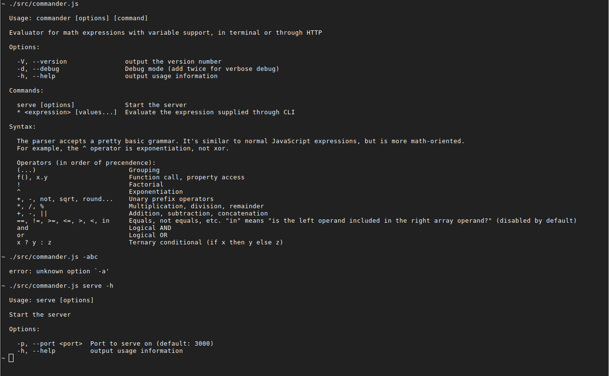

# Node.js argument parsers in 2018 - ...

Deprecated contenders:
- https://github.com/harthur/nomnom
- https://github.com/substack/node-optimist

Contenders:
- http://yargs.js.org/
- https://github.com/tj/commander.js
- https://github.com/substack/minimist
- https://github.com/leo/args
- https://github.com/nodeca/argparse

## Goals

I want an app I can use like this:

Command|What happens
-------|------------
`app -h`|Help screen is shown. It should also work with `--help`.
`app '(x*5)/y'`|Start the app in STDIN mode. Given expression will be executed for each input line (treated as CSV of values in the order they appear inside the expression)
`app '(x*5)/y' x=5 y=7`|In this mode, the command is immediately executed using any number of `var=value` arguments that come at the end.
`app -dd`|Start the app in verbose debug mode (`-d` for normal debug mode). This switch should apply globally, for either web server or CLI use case.
`app serve -p 12345`|Start expression evaluator web server. Note that -p argument only makes sense here. It shouldn't be applicable to the CLI use case.


## commander.js

`commander` | [](https://github.com/tj/commander.js) &nbsp; [](https://www.npmjs.com/package/commander)
|-----|----|
Stars | 11,869
Forks | 907
Downloads / week | 11,262,368
Dependencies | [0](http://npm.broofa.com/?q=commander)
Licenses | MIT

The strongest github presence. One of "the big two". Inspired by Ruby's [commander](https://github.com/commander-rb/commander).

I get a strong stench of a legacy project, where more and more features have been added over the years, distorting the original API surface of the project.

If you do
```
program.command('cmd', 'My command')
```
`"My command"` will "tell" commander you want a git-style command. This is a terrible and non-intuitive API. It's a minefield.

`isDefault` is supposed to make a certain subcommand the default. However, it seems to only be working with git-style commands (where name of the command is directly mapped to an executable on HDD). It doesn't work with `action` style callbacks.

Another way to have "default" command is to name the command `"*"`. That leaves ugly help screen, though.

Common options will be attached on the `program` object, command specific switches will go to the `cmd` argument. It was a bit confusing at first, but it makes sense now that I think about it.

Upsides:

- Has commands and default commands
- Has auto-help generation with description and version number
- You can collect multiple arguments using reduce-like syntax (very neat)
- Good typings support, out of the box
- No dependencies


Downsides:

- Clumsy way to specify long and short parameter names (you can't have a short option without a corresponding long version)
- No concept of default value. You have to insert it into the help text manually (eg. `.option('-p, --port', 'Port to serve on (default: 3000)')`)
- Git-style subcommands were a design mistake.
- Ugly help screen for "*" commands.
- Varargs not displayed in help, need to describe them manually.
- No way to tell when none of the commmands have executed (`executed` variable)

Conclusion:

A decent choice, but surely we can do better?



## Yargs

`yargs` | [](https://github.com/yargs/yargs) &nbsp; [](https://www.npmjs.com/package/yargs)
|-----|----|
Stars | 4,837
Forks | 415
Downloads / week | 17,128,896
Dependencies | [12 / 50](http://npm.broofa.com/?q=yargs)
Licenses | ISC, MIT

"Pirate themed". A bit goofy. A LOT of options.

It seems it recently had a refactoring, so some of the examples are outdated.

Difficult to find my way around the help. Probably because there are so many features.
Example: variadic positional arguments are only mentioned briefly in the advanced usage guide, nowhere are they mentioned in the central API docs.
I have decided to use object-notation to define all the arguments and their switches.

No preambule text available.

Help for commands is not displayed directly on the screen. User has to do "`program command -h`" in order to get help. That is not clearly indicated anywhere on the screen.

Couldn't get it to display full help in case command was called without an expression. Had to do a hacky console.log.

It has bash completion. You have to attach it to every command you want to complete and add it to environment, but it works.

## Caporal

`caporal` | [](https://github.com/mattallty/Caporal.js) &nbsp; [](https://www.npmjs.com/package/caporal)
|-----|----|
Stars | 2,683
Forks | 92
Downloads / week | 15,564
Dependencies | [11 / 80](http://npm.broofa.com/?q=caporal)
Licenses | None, Apache-2.0ISC, MIT

> A full-featured framework for building command line applications (cli) with node.js, including help generation, colored output, verbosity control, custom logger, coercion and casting, typos suggestions, and auto-complete for bash/zsh/fish.

Why would you need a framework for parsing command line arguments? Let's find out.

There is no code outside caporal. All your code should live in action() callbacks that are triggered based on CLI commands.

There is no way to write anything beneath the global command line switches in options. Also, there is no way to get a hook into the help system through an event or similar mechanism. AND you can't disable auto-help and display the help manually. I ended up just adding a "SYNTAX" section that is printed out right above the global options. That's framework for you. Their way or the highway.

I decided to use their API surface, with `--verbose,-v` and `--silent` switches, instead of my intended `-dd` api.

There doesn't seem to be an option for `-dd` flag aggregation. It only supports `-d -d` which is lame.

Incomplete documentation. Had to dig through source code multiple times.

Super goofy error message when you call the program without arguments:
`Error: Wrong number of argument(s). Got 0, expected between 1 and Infinity.`
There doesn't seem to be a way to customize it.

It has auto-completion, but I couldn't get it to work.

Overall it's usable and help messages are beautiful. But being a framework seriously limits it. If you like the choices its authors made, it's a solid choice.

## Rejected contenders

### Minimist

`minimist` | [](https://github.com/substack/minimist) &nbsp; [](https://www.npmjs.com/package/minimist)
|-----|----|
Stars | 3,055
Forks | 172
Downloads / week | 13,222,137
Dependencies | [0](http://npm.broofa.com/?q=minimist)
Licenses | MIT

A venerable and extremely popular library. It has two problems, though:

1. Last updated in 2015
2. No option definitions at all

To clarify the second point, you use minimist like this:

```javascript
var argv = require('minimist')(process.argv.slice(2));
console.dir(argv);
```

```bash
$ node example/parse.js -a beep -b boop
{ _: [], a: 'beep', b: 'boop' }
```

Instead of giving it option definitions, you just call it against arguments and it then tries to guess what they mean and packages them into an object. So, no varargs, no help screens, no validation. I'd have to build all of that manually on top of it.

I've decided that's too barebones for what I want out of an argument parser library. Therefore minimist is out. Buckle up, it won't be the last one to go due to this reason.

### Nopt

`nopt` | [](https://github.com/npm/nopt) &nbsp; [](https://www.npmjs.com/package/nopt)
|-----|----|
Stars | 460
Forks | 35
Downloads / week | 7,145,337
Dependencies | [2/4](http://npm.broofa.com/?q=nopt)
Licenses | MIT

What's this? Relatively few github stars, but tons of npm downloads? Turns out, this is the lib that npm.js developed internally to handle parsing for their npm utility (that's why the download count).

> If you want to write an option parser, don't write an option parser. Write a package manager, or a source control system, or a service restarter, or an operating system. You probably won't end up with a good one of those, but if you don't give up, and you are relentless and diligent enough in your procrastination, you may just end up with a very nice option parser.

Unfortunately, even though it has predefined argument definitions, it doesn't seem to have a help layer at all. A weird in-house-ish project that never caught on, doesn't get updated often and should probably be avoided.